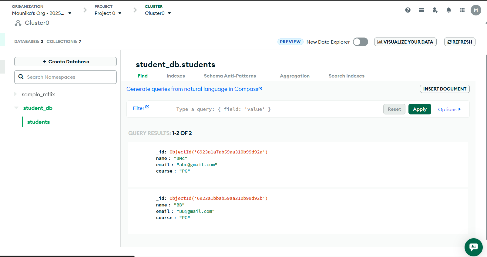
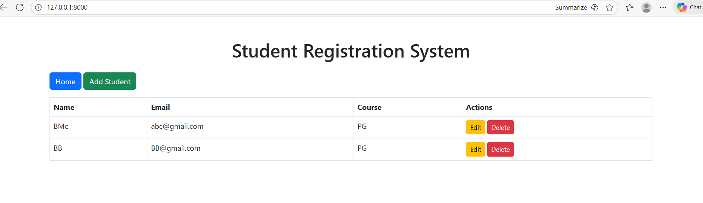
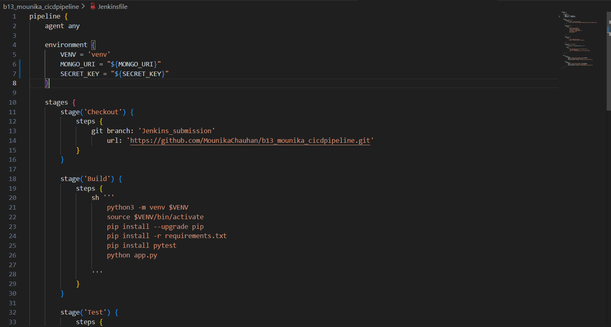
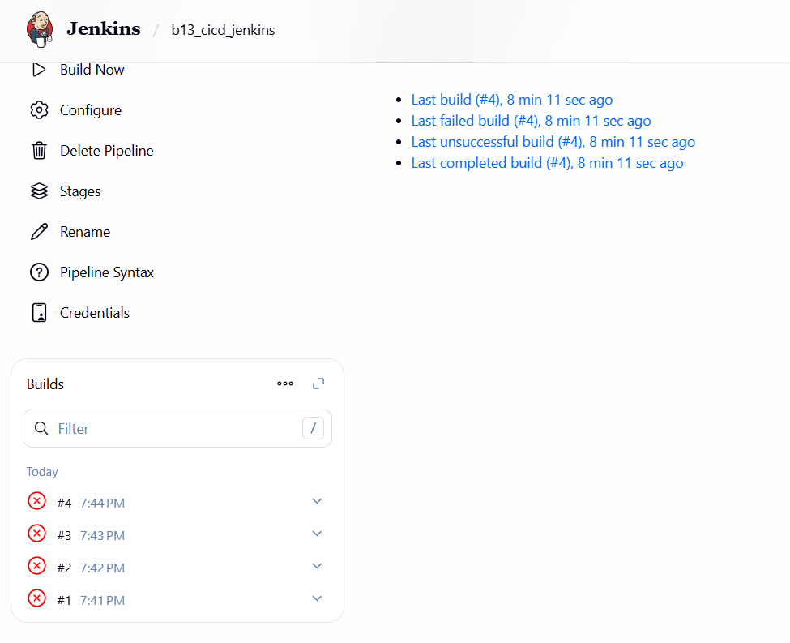
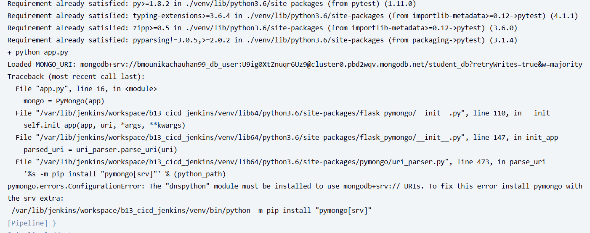
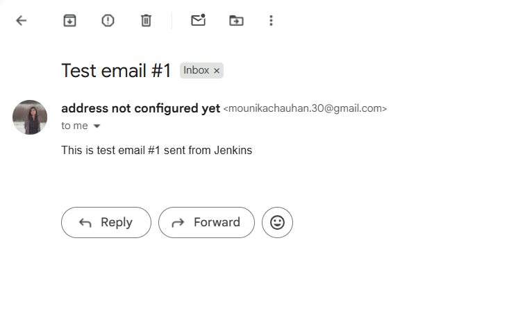

#clone the given repo link for the assignment submission

#For the Jekins assignment, I am Jenkins installed on a local vm

as, we are going to build python app, install the required libraries on the machine.

once the Jenkins is ready.

First we will run the app in local to test whether our application is running.

To run the application we need DB to be created which is in MongoDB.

Once the DB is created, get the connection string and upload in the .env file
after saving the file, run the application using the command provided.

Below screenshot shows the DB created and values provided.

let's create a pipeline for the same in Jenkins with automated test.

1. As we are using the env variable values we need to first declared them globally such that script can be used for fetching 

2. Run the pipeline by updating the script present in Jenkinsfile

This script consists for steps :
a. declare the environment variables
b. checking out to the code 
b. build the application using the commands
d. perform the pytest
e. send a mail for each build run

Intially I have faced the issue with the module not found.

This error, i have fixed by updating the requirement.txt with the missing modules to be imported.

Second issue i have faced was not running the build command in background.

I had to cancel the build and update the command using nohup to run in background.

Email - configuration:

To send the job status over mail,
we need to set up the Email Notification Configuration:
To set this up, initially i have created a App Password in the Gmail security 
and in Manage Jenkins -> Configure System -> Email-Notification 

Provide the required credentials and test the connection.

