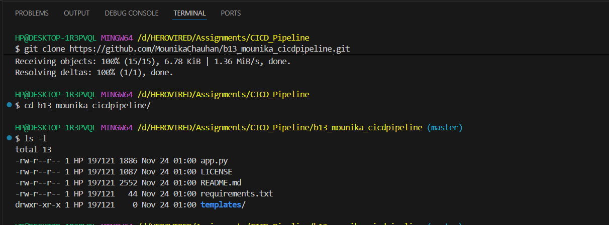
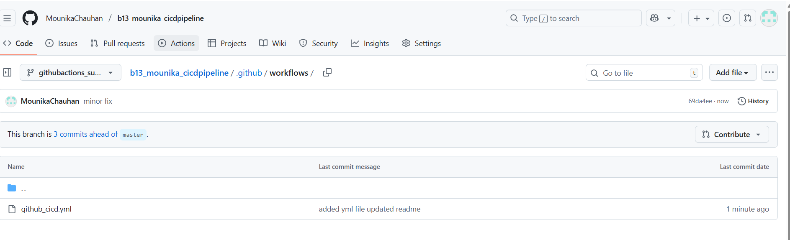
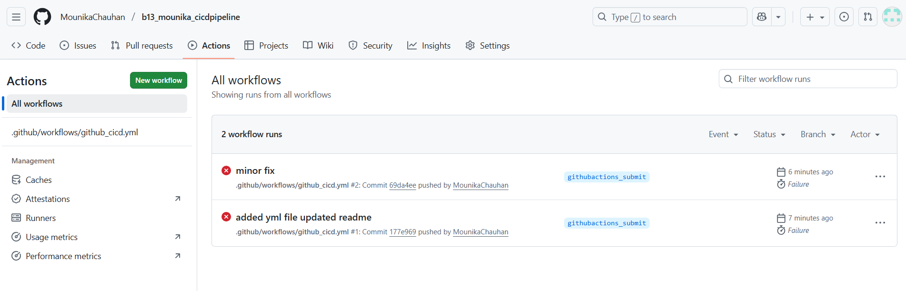

#create a github action pipeline 

To setup the github workflow pipeline.
We need to first create the yml file which contains the pipeline structure.

create a directory ".github/workflows"
create a yaml file as shown in the image

now write the code for the pipeline in the yaml file

Once the code is ready,
go to the actions tab in github

In this section you can see now, there are already 2 runs are done becuase of the trigger mentioned in the yml file 

